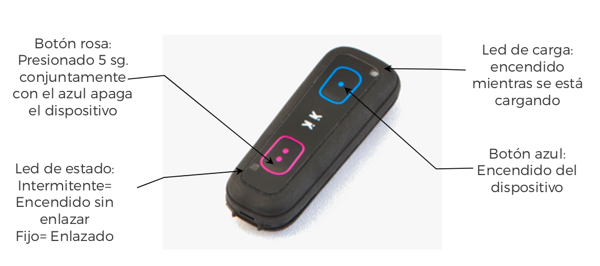
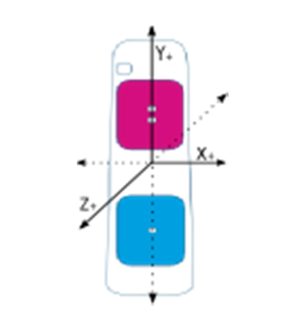
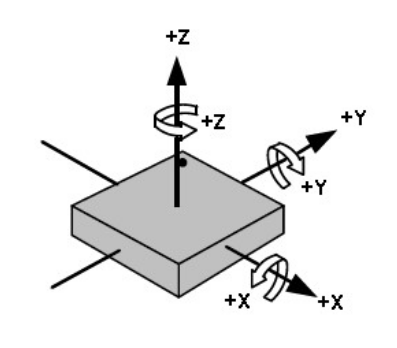

# DESCRIPCIÓN GENERAL
En esta parte de la documentación se describe el funcionamiento físico del dispositivo Pikku en el sistema PikkuLab.

PikkuLab es un sistema multidispositivo que permite el funcionamiento simultáneo de hasta un máximo de 4 dispositivos inalámbricos provistos de sensores tri-axiales de acelerometría y velocidad angular. 
Cada dispositivo consta de dos leds indicadores y dos botones cuyo uso y funcionalidad se detalla en la siguiente imagen:

En la siguiente figura se fija el sistema de referencia de los 3 ejes de los sensores respecto a la envolvente:

Los sensores de giro y acelerometría tienen los siguientes ejes y signos:

Las unidades y rangos que se usan en cada sensor son las siguientes:

- **ACELEROMETRO:** Aceleración en g’s (1g equivale a 9,8m/sg2). Rango ± 16G. Programable a ± 2G, ± 4G. ± 8G. ± 16G 
- **GIROSCOPIO:** Velocidad angular en º/s (grados por segundo). Rango ± 2.000 º/s. Programable a ± 250,± 500,± 1.000 y ± 2.000 º/s 

Los pasos a seguir para utilizar el sistema son los siguientes:

 **1.** Encender los dispositivos.

Para encender el dispositivo, se pulsa el botón azul. Para apagarlo, se presionan ambos
botones a la vez durante 5 sg.

El dispositivo se apaga automáticamente tras 3,5 minutos sin estar enlazado a ningún móvil o tableta para optimizar la autonomía de la batería.
La recarga de la batería se realiza mediante un cargador microUSB estándar de 5V.

**2.** Enlazar los dispositivos que vamos a usar (máximo 4). Ver manual de la APP.

**3.** Definir el perfil: dispositivos, configuración de sensores, velocidad de datos ...

**4.** Conectar los dispositivos

**5.** Visualizar o almacenar los datos

