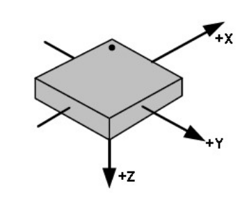

# DESCRIPCIÓN GENERAL
El sistema está compuesto por dispositivos (máximo actual 4) provistos de sensores de
acelerometría, giroscopio y magnetómetro, cada uno de ellos en sus tres ejes. Estos
dos botones como se muestran en la figura:

Los 3 ejes tienen la siguiente orientación y signos respecto a la envolvente:

Los sensores de giro y acelerometría tienen los siguientes ejes y signos:

El magnetómetro tiene los siguientes ejes:

En la siguiente tabla se puede ver la correspondencia entre ejes y signos:

| Acelerómetro y giroscopio | +X |+Y |+Z | 
|--|--|--|--|
|**Magnetómetro**|**+Y** |**+X** |**-Z** |

Las unidades y rangos que se usan en cada sensor son las siguientes:

 - **ACELEROMETRO:** Aceleración en g’s (1g equivale a 9,8m/sg2). Rango ± 16G.
Programable a ± 2G, ± 4G. ± 8G. ± 16G 
- **GIROSCOPIO:** Velocidad angular en º/sg (grados por segundo). Rango ± 1.000 º/sg
- **MAGNETOMETRO:** Campo Magnético en μT (micro Teslas). Rango ± 4.800μT

Los pasos a seguir para utilizar el sistema son los siguientes:

 **1.** Encender los dispositivos

 **2.** Enlazar los dispositivos que vamos a usar (máximo 4)

 **3.** Definir el perfil (que sensor/es queremos usar/almacenar de cada
dispositivo)

**4.** Conectar los dispositivos

**5.** Visualizar o almacenar los datos

Para encender el dispositivo, se pulsa el botón azul. Para apagarlo, se presionan ambos
botones a la vez durante 5 sg. El dispositivo se apaga automáticamente tras 3,5 minutos
sin estar enlazado a ningún móvil o tableta.
