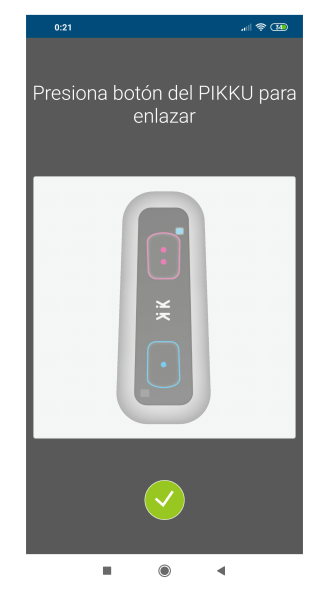

# PANTALLAS App
El esquema de menús de la App es como sigue:

 - Pantalla principal
	 - Configuración
		 - Enlazar dispositivos
			 - Enlazar nuevo dispositivo
			 - Borrar Dispositivo enlazado
		 - Configurar Perfiles
			 - Añadir perfil
				 - Nuevo nombre
			 - Seleccionar perfil / características perfil
				 - Modificar / Guardar características del perfil
				 - Eliminar Perfil
	 - Seleccionar Perfil de Sesión
	 - Conectar Dispositivos
	 - Graficas
		 - Seleccionar Grafica 1
		 - Seleccionar Grafica 2
		 - Seleccionar Grafica 3
	 - Ratios
		 - Análisis estático múltiples dispositivos
			 - Descargar PDF ratios
		 - Análisis dinámico Dispositivo Individual
		 - Análisis de Ángulos en Marcha
		 - Comparativa de ángulos en línea
	 - Capturar
		 - Códigos de Sesión
		 - Capturar
		 - Configurar Captura
			 - Libre
			 - Tiempo fijo
			 - Intervalos
	 - Video
		 - Configurar (seleccionar grafica a mostrar con el video).

	

La aplicación se basa en la visualización / captura de los datos provenientes de los
diferentes sensores de los dispositivos.

Para elegir en cada sesión qué dispositivos se usan y qué sensores se quieren transmitir
para ser almacenados, utilizamos PERFILES. Cada perfil almacena la información de
número de dispositivos y sensores activos por dispositivo. Podemos tener tantos perfiles
como necesitemos para cada una de las sesiones.

## Iniciar la App: Pantalla principal
Al iniciar la App nos aparece la siguiente pantalla:

## Configuración
Desde esta pantalla podemos gestionar el enlace de los dispositivos (enlazar o borrar) y
configurar los perfiles que usaremos en la captura de datos.

### Enlazar dispositivos
Si accedemos al menú “Enlazar Dispositivos” podemos enlazar los dispositivos  o borrar el enlace 

Al presionar el icono Enlazar Dispositivo , nos aparecerá la siguiente pantalla:

Cuando aparezca la pantalla anterior, encenderemos el dispositivo presionando el botón
azul o si ya está encendido, lo presionaremos:

El pikku de la pantalla pasará de color transparente a color intenso, indicando así que el
enlace se ha realizado. También aparecerá la MAC del dispositivo enlazado. Este enlace se guardará y no se borrará mientras no se elimine mediante el botón  o enlazando otro dispositivo.

Se repetirá la acción con el número de dispositivos que queramos gestionar (hasta un
máximo de 4).

### Configurar Perfiles
Si desde la pantalla Configuración presionamos en “Configurar Perfiles”, nos mostrará la
lista de perfiles.
Los perfiles sirven para configurar qué dispositivos van a usarse durante la sesión y qué
sensores de cada uno de ellos se quieren visualizar o almacenar.

Para crear un nuevo perfil, pulsaremos el icono 

Nos pedirá el nombre del nuevo perfil. En este caso le hemos llamado “Prueba”.

Para definir las características del perfil, presionamos sobre el perfil que queremos
configurar y nos aparecerá la siguiente pantalla:

Una vez seleccionada la configuración, guardaremos los datos de la configuración del
perfil y retrocederemos en las pantallas hasta llegar a la pantalla principal.

## Seleccionar Perfil de sesión, conectar dispositivos

Seleccionamos el perfil que queramos usar (de los guardados anteriormente) y pulsamos
en “Conectar dispositivos”.

Los dispositivos definidos en el perfil (y realizado el enlace previamente) se conectarán,
pasando de negro a azul los iconos correspondientes a los dispositivos (en la barra inferior
de la pantalla principal de la app). También se mostrará para cada uno de ellos el nivel
de batería.

Desde los 4 iconos centrales de la pantalla principal se puede visualizar y almacenar los
diferentes datos de los dispositivos.

## Gráficas
Desde este icono  se puede acceder a la visualización de las gráficas. Se puede elegir
cualquier sensor de los dispositivos del perfil.

Se pueden visualizar hasta un máximo de 3 sensores (pueden ser de un mismo
dispositivo o de tres dispositivos diferentes).

## Ratios 

Ratios  permite tener acceso a datos y cálculos ajustados a los diferentes escenarios
predefinidos de pruebas.

Los escenarios actualmente definidos son los siguientes:

**A.- ANÁLISIS ESTATICO MULTIPLES DISPOSITIVOS :** Permite la obtención de valores de
acelerometría y ángulos (actual, máximo, mínimo y media) para el caso de que el
dispositivo pase de una posición a otra y se encuentre en estado ESTATICO en el
momento de la medida. Permite ver estos datos de 4 dispositivos simultáneos.

**B.- ANÁLISIS DINÁMICO DISPOSITIVO INDIVIDUAL :** Permite la obtención de valores de
inclinación respecto de los planos ZY y XY (actual, máximo, mínimo y media), ciclos y
frecuencia para el caso de OSCILACIONES PERIODICAS en las que el dispositivo pasa de
una posición a otra cruzando la vertical y sin impacto en suelo. Permite obtener los datos
de un solo dispositivo.

**C.- ANÁLISIS DE ANGULOS EN MARCHA :** Permite la obtención de valores de Flexión y
Extensión así como el valor actual del ángulo. Los valores mostrados son la media de los
valores obtenidos en los ciclos que se muestran en la pantalla. También permite obtener
otros parámetros del análisis de la marcha: frecuencia, tiempo de pisada, tiempo de
vuelo e impacto de la pisada. Permite obtener los datos de dos dispositivos, el primero
para la pierna derecha y el segundo para la pierna izquierda.

Para este análisis, se colocan los dispositivos en la cinta alrededor de cada uno de los
muslos según se puede ver en la siguiente figura (led de estado hacia arriba):

**D.- COMPARATIVA DE ANGULOS EN LINEA :** Permite la obtención de valores y
visualización de los ángulos de cada uno de los dispositivos en dos de sus ejes: XY y ZY.

### Análisis estático múltiples dispositivos

Desde Ratios se tiene acceso a los valores actuales, medios, mínimos y máximos de los
acelerómetros de cada dispositivo. También se tienen los ángulos de inclinación de los
planos XY y ZY respecto a la vertical, en sus valores actuales, medios, mínimos y máximos
así como la rotación respecto del eje Y.

La representación numérica y gráfica de ángulos parte de una situación inicial del
dispositivo como se muestra en la figura (eje y en vertical):

Si el dispositivo inclina su plano XY respecto a la vertical, el ángulo  aumenta (situación
inicial 0 grados). Lo mismo ocurre si inclina su plano ZY respecto la vertical, en este caso
se incrementa en ángulo  desde una situación inicial de 0 grados.

Si lo que se quiere es medir un ángulo desde una posición diferente a la inicial (situación
de partida con eje “y” en vertical), se pulsará el Botón Offset en la nueva posición inicial, y
se girará el dispositivo desde esta posición. La medida visualizada corresponderá al
ángulo desde la nueva posición inicial.

Para volver a la situación inicial de eje “y” vertical, se pulsará el botón de Cancelación de
offset (el mismo que se presionó para fijar el offset). A partir de este momento todos los
ángulos serán respecto de la posición inicial original (eje “y” en vertical).

### Análisis dinámico dispositivo individual

### Análisis de ángulos en marcha

En este escenario pueden obtenerse los datos relativos a la marcha: Flexión – Extensión.
**El análisis es para la pierna derecha con el dispositivo 1** y la **pierna izquierda con el
dispositivo 2.**

### Comparativa de ángulos en línea

En este apartado puede obtenerse los ángulos de cada uno de los dispositivos respecto
de la vertical en los ejes XY y ZY.

## Capturar 

Desde este icono    se puede almacenar en un fichero con formato hoja de cálculo (.xls), los
valores de los sensores y dispositivos configurados en el perfil.

Cada dispositivo transmite muestras a una frecuencia diferente dependiendo del
número de sensores y ejes que se tengan activados.

La velocidad de transmisión de muestras depende del número de sensores y ejes que
cada dispositivo tiene activado en el perfil.

Existe una velocidad de captura de muestras (periodo) base que es variable. Si
suponemos que XX ms es el periodo base, cada XX ms se obtendrá una muestra
completa con los valores de todos los sensores y ejes (3 sensores x 3 ejes = 9
muestras/dispositivo y por periodo).

Cuantos menos sensores y ejes activemos la velocidad de transmisión se verá
incrementada.

En la siguiente tabla se puede ver el número de muestras transmitidas en cada periodo
base en función de los Sensores y ejes activados en un dispositivo:

En la siguiente tabla se puede ver la frecuencia aproximada (muestras/sg recibidas) en
función de los Sensores y ejes activados en un dispositivo en el caso de que XX (periodo
base) sea 50 ms:

En caso de que el periodo base XX sea de 20 ms, obtendríamos unas frecuencias
aproximadas de:

De cualquier forma, en el fichero Excel generado se muestra la frecuencia de muestras
recogidas en el encabezado de cada uno de los dispositivos, sobre la celda de la
componente Acy.

Si accedemos a “Capturar”:

Una vez completados los datos identificativos de la sesión, podemos configurar el tipo de
captura.

Hay tres tipos:

 - **Libre:** Se inicia y se finaliza por medio de la pulsación de los iconos  y 
 - **Tiempo Fijo:** Se introduce el tiempo que se quiere almacenar. Sólo se inicia la
	captura de datos con el botón , y finaliza automáticamente al transcurrir el
	tiempo configurado.
	
 - **Intervalos:** Se configura el número de intervalos, la duración del intervalo, y el
tiempo entre cada intervalo. Se inicia de la misma forma que en los tipos
anteriores y finaliza automáticamente.

El fichero Excel generado tiene el siguiente aspecto, almacenando los sensores y
dispositivos seleccionados en el perfil. La ruta donde almacena el fichero es en el
dispositivo móvil, carpeta Pikkulab.

## Video 

Desde esta opción  se puede grabar vídeo mientras se visualiza una de las gráficas de uno
de los dispositivos. Se usa para asociar movimientos visualmente a cambios en las
gráficas.

Para iniciar la grabación pulsaremos el icono  nos preguntará si queremos empezar a
capturar la imagen y aceptaremos. En ese momento se iniciará la grabación. Para detenerla, pulsar el botón “pausa”.

En la imagen de la cámara aparece justo debajo del recuadro de la imagen, el número
de muestra que se está grabando en ese momento. Esto nos permite que, al hacer pausa
en el vídeo durante el momento que queramos estudiar, podamos ir al fichero Excel y
analizar las muestras cercanas a la muestra obtenida en el video. Permite asociar
instantes en el video con número de muestra en el fichero de datos.

Además del fichero de video en formato mp4, se almacena un fichero Excel con los datos
para tener los valores de todos los sensores y dispositivos definidos en el perfil de forma
numérica.

En la siguiente imagen puede verse los tipos de ficheros que se almacenarán en la ruta:
Almacenamiento Interno>Pikkulab>

Para más información:

Email: info@pikkusports.com

URL: www.pikkusports.com

Pikkusports es una marca registrada de Blautic Design, S.L.

